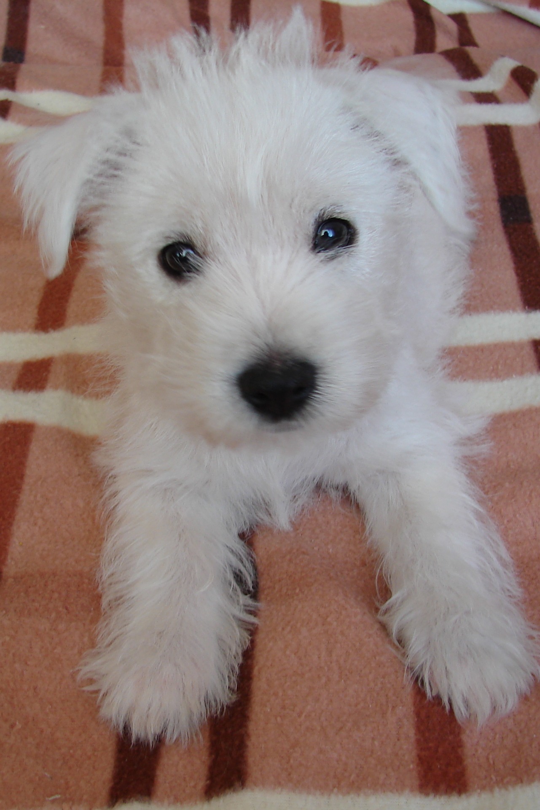

### Бессвязные фрагменты о себе

***

Вопрос один мне мысли путает опять

И карандаш в руке не придает отваги:

Как научиться ясно чувства излагать,

Пустыми знаками не пачкая бумаги?
      
​На белый лист, увы, всех мыслей не излить,

​Покуда опыта в сложеньи фраз так мало.

​Не лучше ль снова ничего не говорить,

​Чтобы не выглядеть убого и отстало?

  *(c) Mazainsk*
      
***

*In loving memory **Azalia**, West Highland White Terrier, 18.12.2012-10.11.2024*

***

> [!NOTE]
>
> *Коль вы из тех уже, кто воплощает роль,*
>
> *Питая лесть к себе, тщеславия горнило,*
>
> *Забудьте прошлое, что принесло вам боль,*
>
> *Но не теряйте то, чему вас это научило.*
>
> ​	*(c) Mazainsk, 12/2024*
